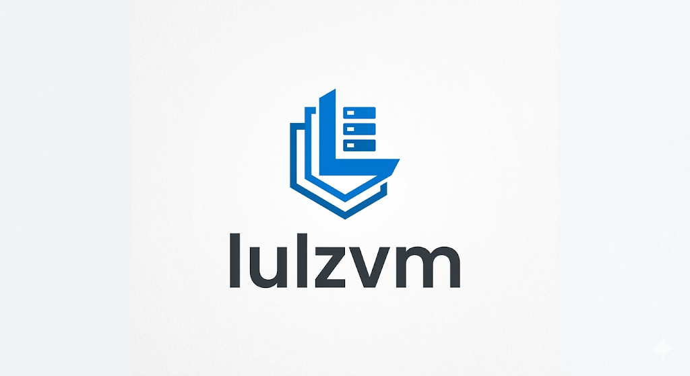

<p align="center">
  
</p>

<p align="center">
  <a href="LICENSE"></a>
  <a href="https://hub.docker.com"></a>
  <a href=".github/CONTRIBUTING.md"></a>
  <a href="https://github.com/Bobbydelhi/lulzvm/discussions"></a>
</p>


> **lulzVM** is a lightweight, web-based hypervisor management platform — your self-hosted alternative to Proxmox. Manage QEMU/KVM virtual machines and LXC containers from a clean browser UI without any authentication headaches. Just clone, run, and start virtualizing.

---

## Features

-  **Virtual Machine Management** — Create, start, stop, reset and delete QEMU/KVM VMs with full disk, CPU and memory control
-  **Container Management** — Spin up LXC containers alongside your VMs
-  **Network Configuration** — Live view of physical interfaces and full Linux Bridge management from the UI
-  **Storage Pools** — Directory-based ISO storage with drag-and-drop ISO upload
-  **Node Dashboard** — Real-time overview of CPU, RAM and VM/container state
-  **100% Dockerized** — One command deploy on any Linux server
-  **No Authentication** — Designed for trusted LAN environments; no login friction

---

##  Quick Start (5 minutes)

### Prerequisites

| Requirement | Version |
|---|---|
| Docker | 24+ |
| Docker Compose | 2.0+ |
| Linux Host OS | Kernel 5.x+ (KVM support) |

> ⚠️ **Note:** lulzVM must run on a **Linux bare-metal or Linux VM host** to access `/dev/kvm` and create network bridges. Docker Desktop on macOS/Windows is only suitable for UI development and testing.

### 1. Clone the repository

```bash
git clone https://github.com/Bobbydelhi/lulzvm.git
cd lulzVM
```

### 2. Start the platform

```bash
docker-compose up -d --build
```

### 3. Open the web interface

```
http://<your-server-ip>:8006
```

That's it. No config files to edit, no passwords to set.

---

## 🐳 Docker Architecture

```
lulzVM/
├── Dockerfile           # Single-stage Python 3.11 slim image
├── docker-compose.yml   # Privileged container + KVM device passthrough
├── main.py              # FastAPI entrypoint
├── config.py            # Pydantic settings (paths, defaults)
├── models.py            # Shared data models
├── api/                 # REST API routers
│   ├── vms.py           # VM CRUD + lifecycle
│   ├── containers.py    # LXC container management
│   ├── storage.py       # ISO upload + pool listing
│   ├── nodes.py         # Node stats
│   └── network.py       # Bridge + interface management
├── core/                # Business logic
│   ├── vm_manager.py    # QEMU process orchestration
│   ├── ct_manager.py    # LXC orchestration
│   ├── storage.py       # Disk creation (qcow2/raw/ZFS)
│   └── network.py       # TAP/bridge Linux networking
└── static/              # Frontend (Vanilla JS + CSS)
    ├── index.html
    ├── app.js
    └── style.css
```

The container runs with:
- `privileged: true` — required for KVM and bridge creation
- `/dev/kvm` device passthrough — hardware-accelerated virtualization
- `network_mode: host` — full access to physical network interfaces

**Persistent volumes:**

| Volume | Host Path | Purpose |
|---|---|---|
| `lulzvm_data` | Docker managed | VM disks and ISOs |
| `lulzvm_config` | Docker managed | TOML config files |
| `lulzvm_lxc` | Docker managed | LXC container rootfs |

---

##  Configuration

lulzVM auto-generates sensible defaults on first run. For advanced configuration, create `/etc/lulzvm/lulzvm.toml` inside the container (mount a volume to persist it):

```toml
[daemon]
host = "0.0.0.0"
port = 8006
workers = 4
log_level = "INFO"

[paths]
config_dir = "/etc/lulzvm"
run_dir    = "/run/lulzvm"
log_dir    = "/var/log/lulzvm"

[defaults]
vm_memory_mb  = 512
vm_cores      = 1
vm_storage_gb = 10
default_bridge = "lulzbr0"
```

---

##  Network Setup (Production)

On a production Linux server, go to the **Network** tab in the UI to:

1. View all physical network interfaces (e.g. `eth0`, `enp3s0`)
2. Create a Linux Bridge (e.g. `lulzbr0`) and attach your physical interface to it
3. Click **Apply Changes** — lulzVM will run `ip link` commands live

This gives VMs layer-2 access to your physical network so they can get IPs from your existing DHCP/router.

---

##  Contributing

**lulzVM is built by the community, for the community.** We genuinely want your contributions — from bug fixes and translations to entire new features.

>  *"Between all of us, we can build something powerful. Every improvement counts."*

Please read [CONTRIBUTING.md](.github/CONTRIBUTING.md) before opening a Pull Request.

**Quick contribution guide:**
1. Fork the repository
2. Create a feature branch: `git checkout -b feature/my-feature`
3. Make your changes and test them
4. Open a Pull Request — our maintainers will review it before merging

All PRs go through code review before merging into `main`. This ensures the codebase stays clean, safe and virus-free for everyone who clones it.

---

##  Security

lulzVM is designed for **trusted LAN environments** (home labs, private data centers). 

- **Do NOT expose port 8006 directly to the internet without a reverse proxy + authentication layer** (e.g. Nginx + OAuth2-proxy)
- Report security vulnerabilities privately via [SECURITY.md](.github/SECURITY.md)

---

##  License

MIT License — free to use, modify and distribute. See [LICENSE](LICENSE) for details.

---

<p align="center">
  Made with ❤️ by the lulzVM community — <a href="https://github.com/Bobbydelhi/lulzvm/discussions">Join the discussion</a>
</p>
